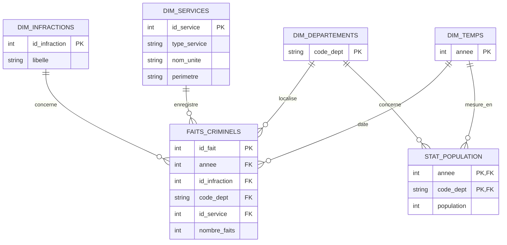

---

## Légende des Cardinalités

| Symbole | Signification | Explication dans ce projet |
| :--- | :--- | :--- |
| `\|\|--o{` | **Un vers Zéro ou Plusieurs** | Un département peut exister dans la table `DIM_DEPARTEMENTS` même s'il n'a aucun fait criminel enregistré pour une année donnée. |
| **PK** | **Primary Key** | Clé primaire unique identifiant chaque ligne de la table. |
| **FK** | **Foreign Key** | Clé étrangère permettant de lier une table de faits à une dimension. |
| **PK, FK** | **Clé Composée** | Dans `STAT_POPULATION`, l'identifiant unique est le couple (Année + Département). |
